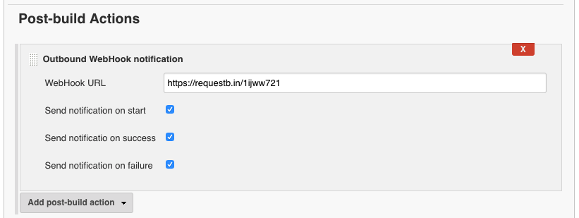

# Jenkins WebHook plugin

Outbound WebHook for Jenkins build events


## Configration




## Sample payload

```json
{
  "buildName": "#16",
  "buildUrl": "http://example.com/job/test%20job/16/",
  "event": "success",
  "projectName": "test job"
}
```


## Compile

./gradlew build


## Test

./gradlew test


## Run server

./gradlew server

Visit http://localhost:8080

The frist time you visit it, you are required to go through the setup process.
Please **don't install** any third-party plugins. This plugin we currently working on will be installed by default.


## Admin user

I use the following credential for testing:

```
admin/admin
```

Of course you don't have to copy my example.


## publish

Create a tag on GitHub: `outbound-webhook-plugin-<version>`.

Create file `~/.jenkins-ci.org` with the following content:

```
userName=username
password=password
```

Note: The credentials are from https://accounts.jenkins.io/.

Run `./gradlew clean publish`.
